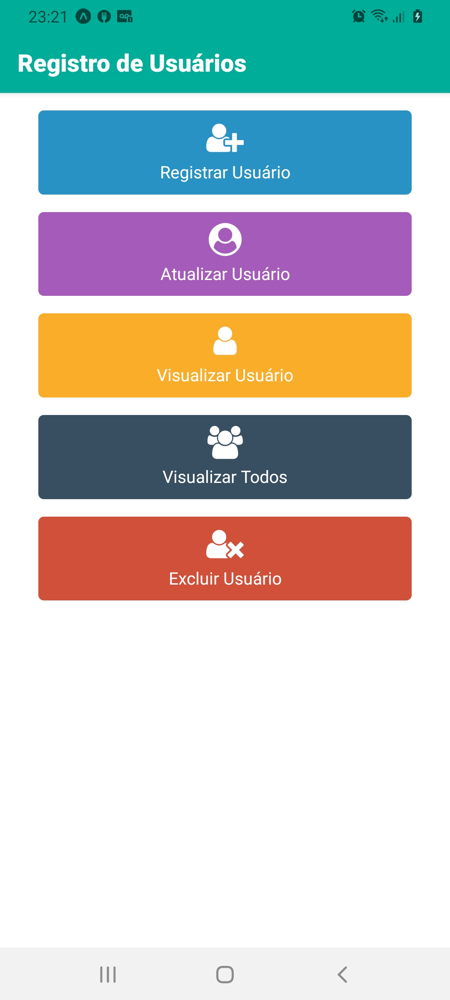
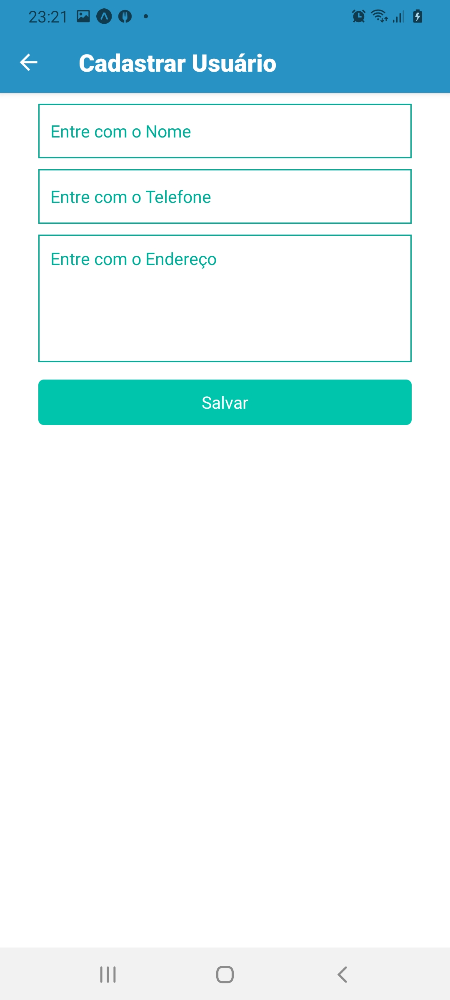
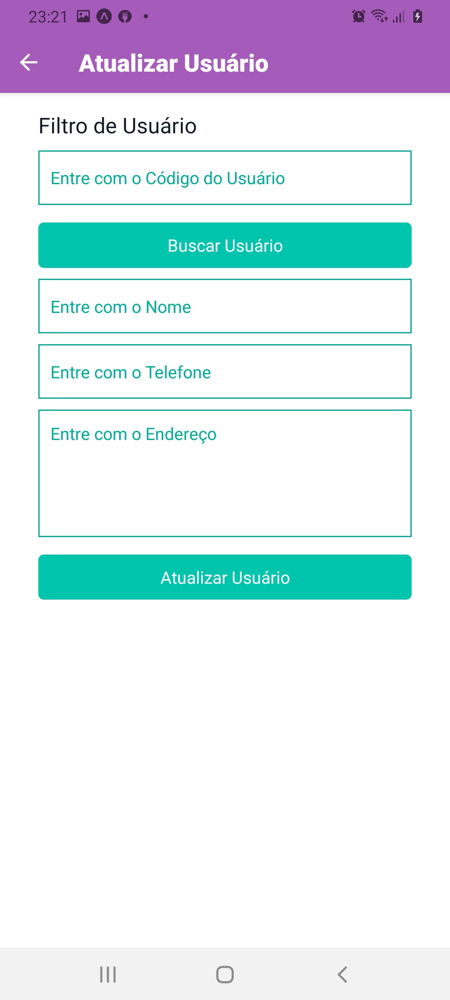
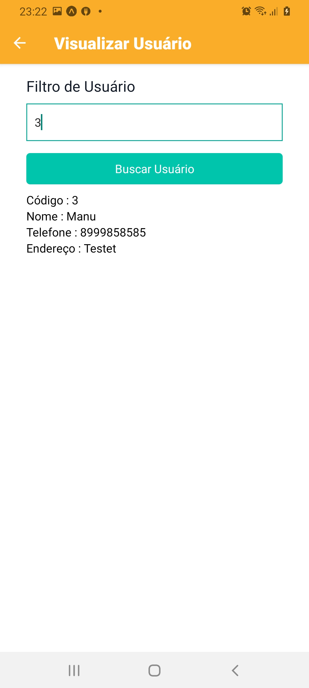
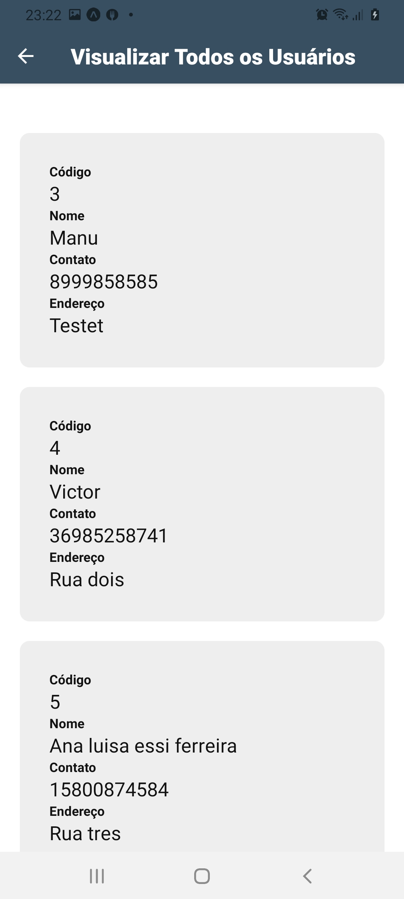
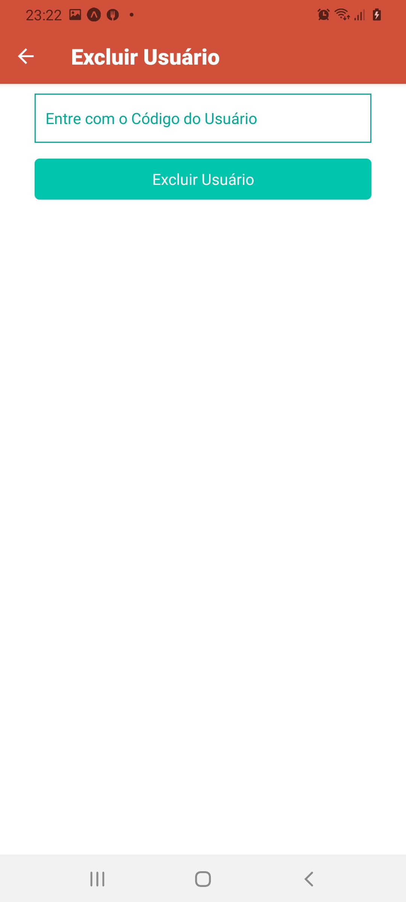

<!-- ************************************* Título ********************************************* -->
<h1> CRUD React Native com SQLite </h1>

<!-- ************************************* Baadges ********************************************* -->
<p align="center">
  

 

 
</p>

## 🚀 Sobre o Projeto
</br>

Esse Projeto consiste em um App de Registro de Usuários, com as funcionalidades básicas de um CRUD ( Create / Read / Update / Delete ), utilizando o banco de Dados SQLite para gravação local dos dados. Ao rodar o projeto ele verifica se o banco existe caso não exista ele cria o banco de dados e a estrutura da tabela para ja dar início a utilização do mesmo.

</br>

## 🖼️ Imagens do Projeto

</br>

<div align="center">
  
  
  
  
  
  
</div>

</br>

## 🛠️ Construído com

* [NodeJS](https://nodejs.org/en/) - Ambiente de execução Javascript
* [Vs Code](https://code.visualstudio.com/) - IDE
* [React Native](https://reactnative.dev/) - O framework Mobile usado
* [Expo](https://expo.io/) - Facilitador de visualização
* [SQLite](https://www.sqlite.org/index.html) - Banco de Dados
* [DB Browser for SQLite](https://www.sqlite.org/index.html) - IDE do Banco de Dados

* Dependências
  * @react-native-community/masked-view
  * @react-navigation/native
  * @react-navigation/stack
  * expo
  * expo-sqlite
  * expo-status-bar
  * react-native-gesture-handler  
  * react-native-reanimated
  * react-native-safe-area-context
  * react-native-screens 
  * react-native-vector-icons

</br>

<h3> 🎲 Rodando o Projeto</h3>

- É Necessário : 
    - Ter o Expo Instalado no PC
    - Ter o Expo Instalado no Celular

```bash
# Clone este repositório
$ git clone https://github.com/brunoemferreira/CRUDReactNativeSQLite.git

# Acesse a pasta backend
$ cd CRUDReactNativeSQLite

# execute o comando
$ yarn start
ou
$ npm start

# O Expo é iniciado no pc mediante o browser e após esse processo acessar o celular e executar o expo
# e fazer a leitura do QRCode que é mostrado no bowser pelo Expo.
```

---
⌨️ com ❤️ por [Bruno Eduardo](https://gist.github.com/brunoemferreira) 😊